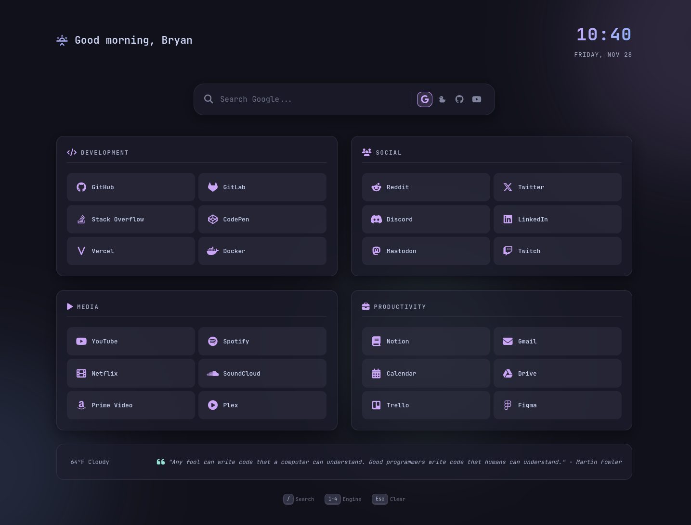

# 🌙 Start Page v3

A modern, dark-themed browser startpage featuring a sleek Catppuccin Mocha color scheme, glassmorphism effects, and dynamic personalization.



## ✨ Features

- **Catppuccin Themes** - Mocha (dark) and Latte (light) color palettes
- **Glassmorphism UI** - Modern frosted glass effects with ambient glows
- **Multi-Engine Search** - Quick switch between Google, DuckDuckGo, GitHub, and YouTube
- **Dynamic Greeting** - Personalized time-based greetings with sunrise/sun/sunset/moon icons
- **Quick Links** - Categorized bookmarks (Development, Social, Media, Productivity)
- **Weather Widget** - Current weather with °F/°C toggle
- **Settings Panel** - Toggle 12hr/24hr clock, temperature units, and theme
- **Inspirational Quotes** - Random quotes to brighten your day
- **Keyboard Navigation** - Fast access with keyboard shortcuts
- **Responsive Design** - Works on all screen sizes

---

## 🧩 Browser Extension Installation

### Chrome / Chromium-based browsers (Edge, Brave, Arc, etc.)

1. Open `chrome://extensions/` in your browser
2. Enable **Developer mode** (toggle in top-right corner)
3. Click **Load unpacked**
4. Select the `startpage` folder
5. Open a new tab to see your startpage!

### Firefox

1. Open `about:debugging#/runtime/this-firefox`
2. Click **Load Temporary Add-on...**
3. Select the `manifest.json` file from the `startpage` folder
4. Open a new tab to see your startpage!

> **Note for Firefox**: For permanent installation, you'll need to:
> - Sign the extension at [addons.mozilla.org](https://addons.mozilla.org)
> - Or use Firefox Developer Edition with `xpinstall.signatures.required` set to `false`

### Creating Extension Icons

The extension needs PNG icons. Generate them from the included `icons/icon.svg`:

```bash
# Using ImageMagick
for size in 16 32 48 128; do
  magick -background none icons/icon.svg -resize ${size}x${size} icons/icon${size}.png
done
```

Or use an online converter like [CloudConvert](https://cloudconvert.com/svg-to-png).

---

## 🚀 Standalone Installation

### Clone the Repository

```bash
git clone https://github.com/bgibson72/start-page-v3.git
cd start-page-v3
```

### Set as Browser Homepage

1. Open the `index.html` file in your browser
2. Copy the file path (e.g., `file:///home/username/start-page-v3/index.html`)
3. Set this as your browser's homepage in settings

**Or host locally:**

```bash
# Using Python
python -m http.server 8080

# Then set http://localhost:8080 as your homepage
```

## ⚙️ Customization

### Change Your Name

Edit `script.js` and find the `userName` variable near the top:

```javascript
const userName = 'Bryan';  // Change to your name
```

### Add/Remove Quick Links

Edit `index.html` and modify the link cards in each category section:

```html
<a href="https://your-site.com" class="link-card">
    <span class="link-icon"><i class="fa-brands fa-icon-name"></i></span>
    <span class="link-text">Site Name</span>
</a>
```

Browse [Font Awesome Icons](https://fontawesome.com/icons) for icon options.

### Modify Categories

Each category is a `<section class="link-group">` in `index.html`. You can:
- Rename categories by changing the `<h2>` text
- Add new categories by duplicating a section
- Remove categories by deleting a section

The grid automatically adjusts (2 columns for even count, 3 for odd).

### Change Color Scheme

Edit `style.css` and modify the CSS variables in `:root`:

```css
:root {
    /* Catppuccin Mocha Colors */
    --crust: #11111b;
    --mantle: #181825;
    --base: #1e1e2e;
    --surface0: #313244;
    --surface1: #45475a;
    --surface2: #585b70;
    --text: #cdd6f4;
    --subtext: #a6adc8;
    --primary: #cba6f7;    /* Mauve - accent color */
    --secondary: #89b4fa;  /* Blue */
    --accent: #f5c2e7;     /* Pink */
    /* ... */
}
```

### Change Weather Units

In `script.js`, find the `fetchWeather` function and change `units=imperial` to `units=metric` for Celsius:

```javascript
const response = await fetch(
    `https://api.open-meteo.com/v1/forecast?latitude=${lat}&longitude=${lon}&current_weather=true&temperature_unit=fahrenheit`
);
```

Change `fahrenheit` to `celsius` for metric units.

### Add Custom Quotes

Edit the `quotes` array in `script.js`:

```javascript
const quotes = [
    "Your custom quote here.",
    "Another inspiring message.",
    // Add more quotes...
];
```

## ⌨️ Keyboard Shortcuts

| Key | Action |
|-----|--------|
| `/` | Focus search bar |
| `1-4` | Switch search engine |
| `Esc` | Clear search / unfocus |

## 🎨 Icons

This startpage uses:
- [Font Awesome 6](https://fontawesome.com/) for most icons
- [Nerd Fonts](https://www.nerdfonts.com/) for DuckDuckGo duck and time-of-day icons

## 📄 License

MIT License - feel free to modify and use as you wish!

---

Made with 💜 using Catppuccin Mocha
